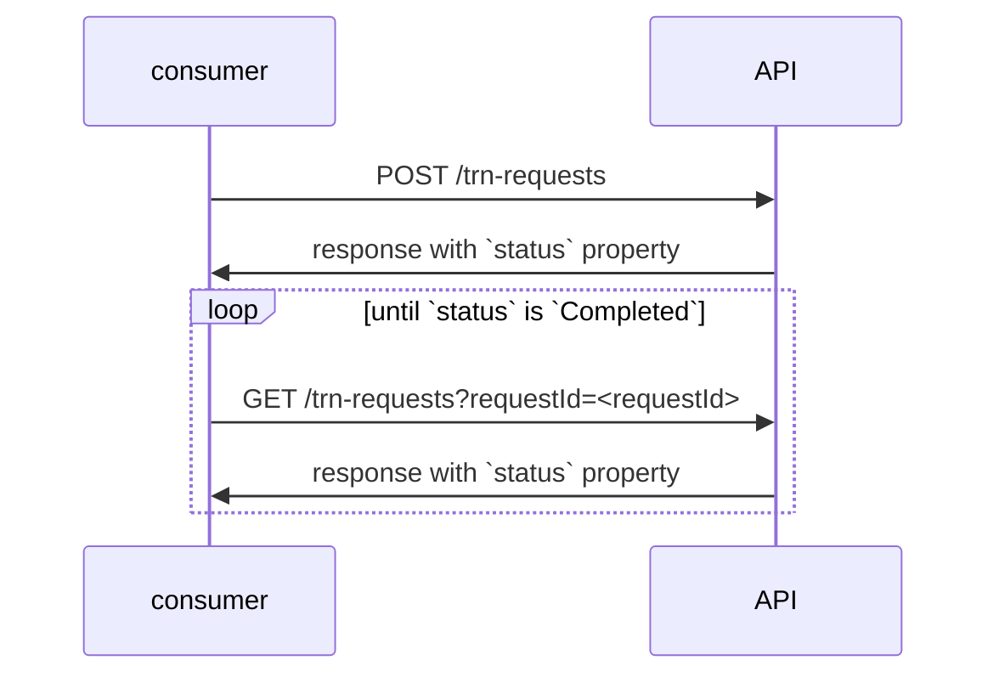

# Request TRN API

Draft specification v0.1.

This API is for consumers who want to submit PII for a person and have that person's existing TRN returned or have a new TRN created, if the person does not already have one.

There are two endpoints; one submits a request and the other retrieves the result of a request.
Consumers must first submit a request (using `POST /trn-requests`) then, if that initial request returns a `Pending` status, poll the `GET /trn-requests` until the status is `Completed`. The same `requestId` should be used in the `GET` as was provided in the `POST`.

## `POST` `/trn-requests`

Request body structure:
```json
{
  "requestId": "",  // the unique identifier for this request
  "person": {
    "firstName": "",
    "middleName": "",
    "lastName": "",
    "dateOfBirth": "",
    "email": "",
  }
}
```

The `requestId`, `person.firstName`, `person.lastName` and `person.dateOfBirth` properties are all mandatory.

`requestId`, `person.firstName`, `person.middleName`, `person.lastName` and `person.email` cannot be greater than 100 characters in length. `person.dateOfBirth` must be formatted `yyyy-MM-dd`.

If there has already been a request submitted with the given `requestId`, a `409 Conflict` status code will be returned.

If any of the request properties are invalid, a `400 Bad Request` status code will be returned.

Response body structure:
```json
{
  "requestId": "",
  "person": {
    "firstName": "",
    "middleName": "",
    "lastName": "",
    "dateOfBirth": "",
    "email": "",
  },
  "status": "Pending|Completed",
  "trn": ""
}
```

The response returns the submitted `requestId`, `person` and adds a `status` property. The `status` property will be either `Pending` or `Completed`. If the `status` is `Completed` the response will also include a `trn` property with the TRN.

## `GET /trn-requests?requestId=<id>`

A `requestId` query parameter must be specified with a value that was used in a `POST` above.

If no request exists with the specified `requestId`, a `404 Not Found` status code will be returned.

Response body structure:
```json
{
  "requestId": "",
  "person": {
    "firstName": "",
    "middleName": "",
    "lastName": "",
    "dateOfBirth": "",
    "email": "",
  },
  "status": "Pending|Completed",
  "trn": ""
}
```

The response returned has the same schema of the response from the `POST` endpoint.

## Usage



Note that some requests require manual review which can take several days. The frequency that the `GET` endpoint is polled should reflect this.
