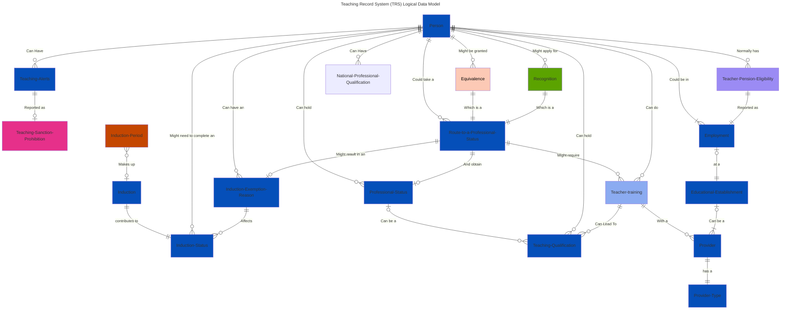

# Logical Data Model

Logical representation of the key data entities and their relationships held within the Teaching Record System (TRS). To note, this does not represent how the data is stored physically.

