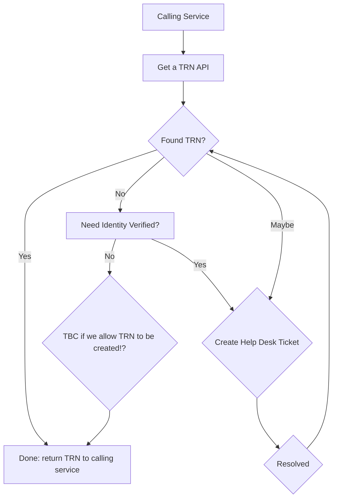

# Teaching Reference Number (TRN)

TRN generation is currently performed by 3 separate organisations, DfE, EWC, and Teaching Pensions. This will change from 2024 when we phase in a new TRN flow. This will have the following characteristics:

* The Department for Education (DfE) will become the only issuer of TRN's
* TRN generation will be RESTFUL API based only (no file generation)
* Calling the API will return:
  *   A TRN (either a new or existing - but the API will not be explicit on if its new or existing)
  *   A "Pending" status

Note: We need to research and confirm if there is a need to allow creation of teaching record without identity verification or not, and what are the rules around this.

