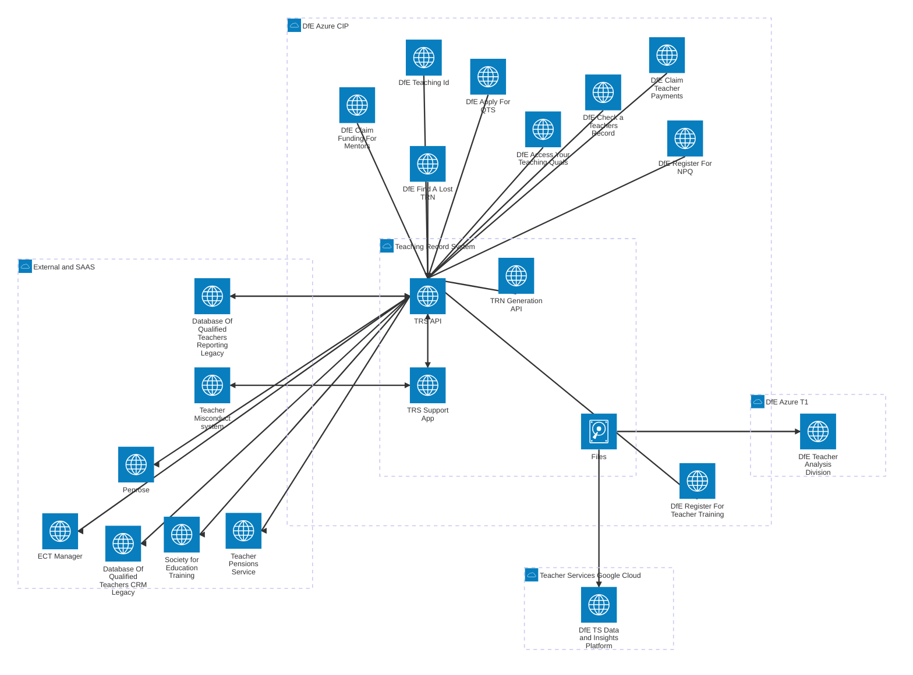

# Data Integrations

A high level view of the TRS data integrations.

```mermaid
architecture-beta
group ext(cloud)[External and SAAS]
service tms(internet)[Teacher Misconduct system] in ext
service tps(internet)[Teacher Pensions Service] in ext
service set(internet)[Society for Education Training] in ext
service dqt(internet)[Database Of Qualified Teachers CRM Legacy] in ext
service dqtrep(internet)[Database Of Qualified Teachers Reporting Legacy] in ext
service ect(internet)[ECT Manager] in ext
service penrose(internet)[Penrose] in ext
group tscgcp(cloud)[Teacher Services Google Cloud]
service dandi(internet)[DfE TS Data and Insights Platform] in tscgcp
group tscloud(cloud)[DfE Azure CIP]
service register(internet)[DfE Register For Teacher Training] in tscloud
service npq(internet)[DfE Register For NPQ] in tscloud
service claim(internet)[DfE Claim Teacher Payments] in tscloud
service check(internet)[DfE Check a Teachers Record] in tscloud
service access(internet)[DfE Access Your Teaching Quals] in tscloud
service afqts(internet)[DfE Apply For QTS] in tscloud
service tid(internet)[DfE Teaching Id] in tscloud
service mentors(internet)[DfE Claim Funding For Mentors] in tscloud
service faltrn(internet)[DfE Find A Lost TRN] in tscloud
group trs(cloud)[Teaching Record System] in tscloud
service trsapi(internet)[TRS API] in trs
service files(disk)[Files] in trs
service trssupport(internet)[TRS Support App] in trs
service trngen(internet)[TRN Generation API] in trs
group tonecloud(cloud)[DfE Azure T1]
service tad(internet)[DfE Teacher Analysis Division] in tonecloud
check:B --> T:trsapi
register:B --> T:trsapi
npq:B --> T:trsapi
access:B --> T:trsapi
claim:B --> T:trsapi
trsapi:B <--> T:trssupport
tms:R <--> L:trssupport
tps:R <--> L:trsapi
files:B --> T:dandi
files:R --> L:tad
set:R <--> L:trsapi
dqt:R <--> L:trsapi
afqts:B --> T:trsapi
tid:B --> T:trsapi
trngen:B --> T:trsapi
mentors:B --> T:trsapi
faltrn:B --> T:trsapi
ect:R <--> L:trsapi
penrose:R <--> L:trsapi
dqtrep:R <--> L:trsapi
```
