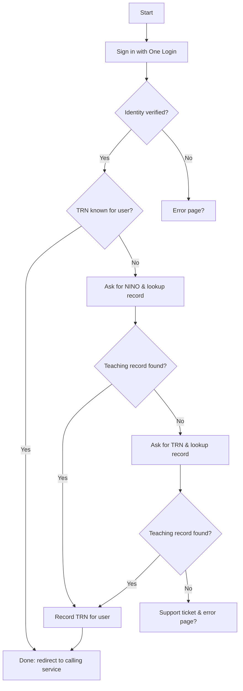

# High level flow of signing in to a service that requires authorisation to the teaching record via GOV.UK One Login

The `start` represents the point at which a user visits a service domain for example [Access Your Teaching Qualifications](https://access-your-teaching-qualifications.education.gov.uk/qualifications/start).
They would be re-directed to [GOV.UK One Login](https://www.sign-in.service.gov.uk/) to sign in. The Teaching Record System will handle the OAUTH flow between GOV.UK One Login and the calling service, as part of this flow it will provide authorisation against the teaching record. Allowing the calling service to grant access depending on finding a match and passing any other access rules needed to access the teaching record data.

