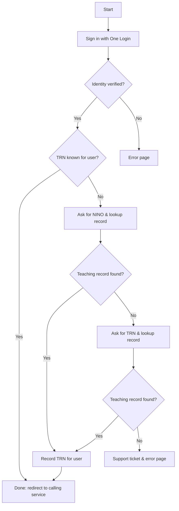
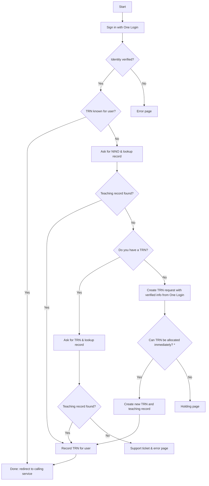

# High level flow of signing in to a service that requires authorisation to the teaching record via GOV.UK One Login

The `Start` represents the point at which a user visits a service domain for example [Access your teaching qualifications](https://access-your-teaching-qualifications.education.gov.uk/qualifications/start).
They would be re-directed to [GOV.UK One Login](https://www.sign-in.service.gov.uk/) to sign in. The Teaching Record System will handle the OAuth flow between GOV.UK One Login and the calling service. As part of this flow it will provide matching and authorisation against the teaching record, only returning to the calling service when this authorisation succeeded. Details of both the One Login user and the teaching record will be passed to the calling service, where it can apply any service-specific rules, if required.

## TRN allocation

The flow below covers services where users may not yet have a TRN and teaching record but they require one (e.g. Register for an NPQ).

\* If the TRN request cannot be allocated immediately (e.g. it requires manual intervention for resolving a potential duplicate), the user is shown a holding page.
When the TRN is eventually allocated it is associated with the One Login user ID and the user is sent an email with the TRN and a link to sign in.
When they return, they need to sign in with One Login only; from there they can proceed to the calling service.
